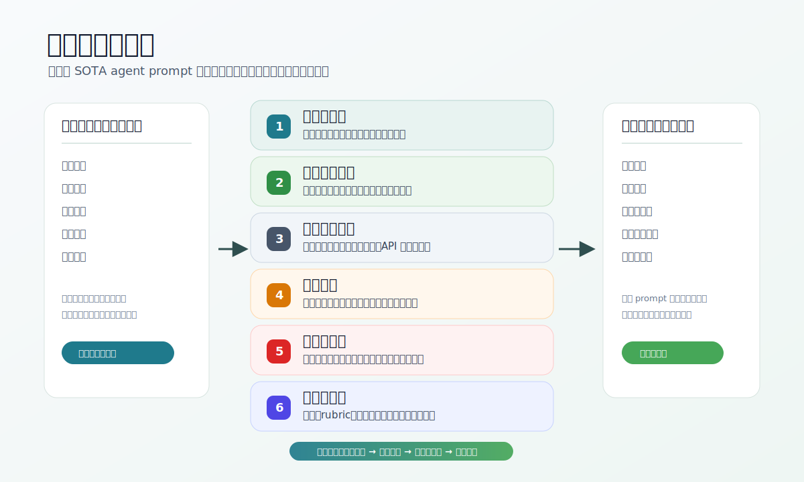
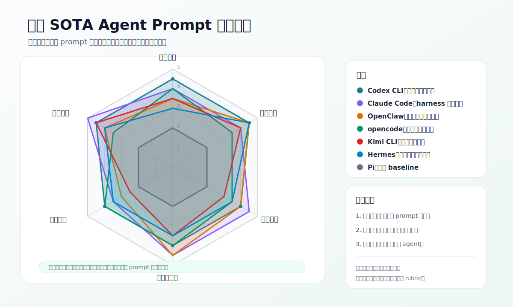
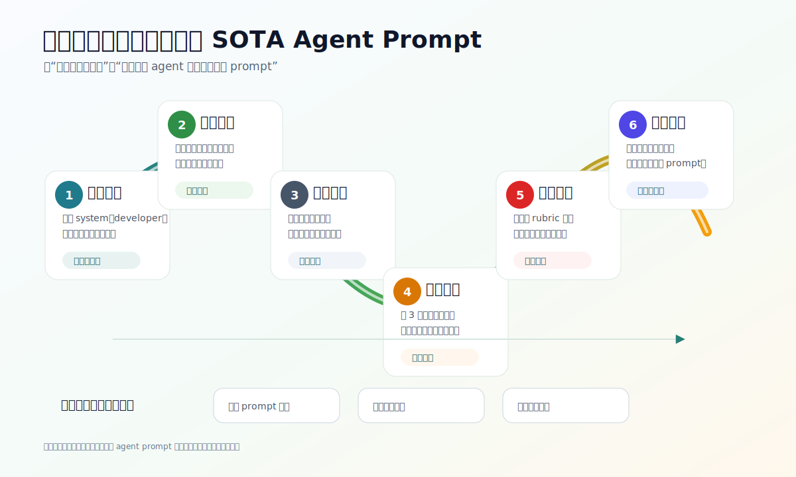

# learn-xx-prompt

面向 AI 产品经理的 SOTA Agent Prompt 学习项目。

这个项目从 [Phistory](https://phistory.cc/) 收录的 agent CLI system prompt 出发，把长而密的提示词拆成产品经理能学习、复用和评审的材料：中文导读、渐进式阅读路径、提示词结构分类、以及可嵌入 README 的 SVG 可视化。

> 当前阶段采用“教育用中文意译 + 结构化导读”，不把上万行英文原文整仓搬运。原文请以 Phistory 链接为准。

## 可视化速览







## 为什么学这些 Prompt

SOTA agent prompt 不是“几句提示词技巧”，而是一份产品运行规约。它同时描述：

- agent 的角色和任务边界
- 可用工具、权限模式和失败恢复
- 什么时候自主推进，什么时候询问用户
- 如何使用记忆、上下文和外部资料
- 如何给用户交付可验证的结果
- 如何约束安全、格式、语气和协作体验

AI 产品经理学习它们，不是为了照抄，而是为了建立一种设计能力：把“模型能力”落成“可控、可评估、可迭代的产品行为”。

## 信息源

本项目使用的 prompt 快照来自 Phistory。版本信息见 [data/phistory-sources.json](data/phistory-sources.json)。

重点样本：

- Claude Code 2.1.177
- Codex CLI 0.139.0
- opencode 1.17.6
- OpenClaw 2026.6.6
- Kimi CLI 1.47.0
- Hermes Agent v2026.6.5
- Pi 0.79.3

## 如何阅读

建议按这个顺序读：

1. 先读 [渐进式阅读入口](docs/reading/00-how-to-read.md)
2. 再读 [提示词结构分类](docs/prompt-taxonomy.md)
3. 按主题阅读 `docs/reading/`
4. 到 `docs/translations/` 看各家 prompt 的中文意译
5. 用 [Prompt Review Checklist](docs/evaluation/prompt-review-checklist.md) 评审自己的 agent prompt
6. 用 `assets/visuals/` 的 SVG 做团队讲解和对比复盘

## AI 产品经理 30 分钟路线

| 目标 | 读什么 | 产出 |
| --- | --- | --- |
| 做竞品研究 | [横向对比入口](docs/comparison/README.md) + [模块覆盖矩阵](docs/comparison/module-coverage-matrix.md) | 一页竞品对比 |
| 写 agent PRD | [提示词结构分类](docs/prompt-taxonomy.md) + [产品级规格模板](docs/templates/product-prompt-spec.md) | 一份 prompt PRD |
| 改自家 prompt | [中文片段库](docs/snippets/README.md) + [高优先级中文片段](docs/snippets/high-priority-zh-snippets.md) | 一版可测试 prompt 草案 |
| 设计评估 | [Prompt Review Checklist](docs/evaluation/prompt-review-checklist.md) + [行为评分 rubric](docs/evaluation/agent-behavior-rubric.md) | 10 条评估用例 |

## 项目结构

```text
learn-xx-prompt/
  README.md
  data/
    phistory-sources.json
  docs/
    prompt-taxonomy.md
    comparison/
    evaluation/
    snippets/
    templates/
    translations/
    reading/
  assets/
    visuals/
```

## 适合的使用方式

- PM onboarding：让新同学理解 agent 产品不是 chat UI，而是工具、权限、上下文和交付协议的组合。
- Prompt review：用结构分类表检查自家 prompt 是否缺少边界、证据或失败处理。
- 竞品研究：用 SVG 和表格比较各家 agent 对自主性、工具调用、记忆、安全的取舍。
- 需求设计：把 prompt 规则翻译成产品需求、状态机、权限弹窗和评估指标。

## 核心材料

| 类型 | 入口 |
| --- | --- |
| 渐进阅读 | [docs/reading/00-how-to-read.md](docs/reading/00-how-to-read.md) |
| 结构分类 | [docs/prompt-taxonomy.md](docs/prompt-taxonomy.md) |
| 中文意译 | [docs/translations/README.md](docs/translations/README.md) |
| 横向对比 | [docs/comparison/README.md](docs/comparison/README.md) |
| 各家模块覆盖矩阵 | [docs/comparison/module-coverage-matrix.md](docs/comparison/module-coverage-matrix.md) |
| 中文片段库 | [docs/snippets/README.md](docs/snippets/README.md) |
| 高优先级中文片段库 | [docs/snippets/high-priority-zh-snippets.md](docs/snippets/high-priority-zh-snippets.md) |
| Prompt 规格模板 | [docs/templates/product-prompt-spec.md](docs/templates/product-prompt-spec.md) |
| 最小 coding agent 模板 | [docs/templates/minimal-coding-agent.md](docs/templates/minimal-coding-agent.md) |
| 评审清单 | [docs/evaluation/prompt-review-checklist.md](docs/evaluation/prompt-review-checklist.md) |
| 行为评分 rubric | [docs/evaluation/agent-behavior-rubric.md](docs/evaluation/agent-behavior-rubric.md) |

## 项目边界

- 本项目是学习材料和产品设计工具箱，不是 Phistory 的镜像站。
- 本项目不主张逐字迁移任何厂商 prompt；重点是学习设计模式。
- 对真实产品改 prompt 前，应结合自己的工具、权限、用户场景和评估结果重新设计。
- 若要把本目录发布为 GitHub 仓库，需要确认 owner、仓库可见性和是否启用 GitHub Pages。

## 当前状态

这是一个初始知识库草案。已完成项目骨架、数据源索引、中文学习路径、核心 prompt 意译和 SVG 可视化的第一版。后续可继续扩展为 GitHub Pages 站点、完整课程、或可交互 prompt diff 阅读器。
